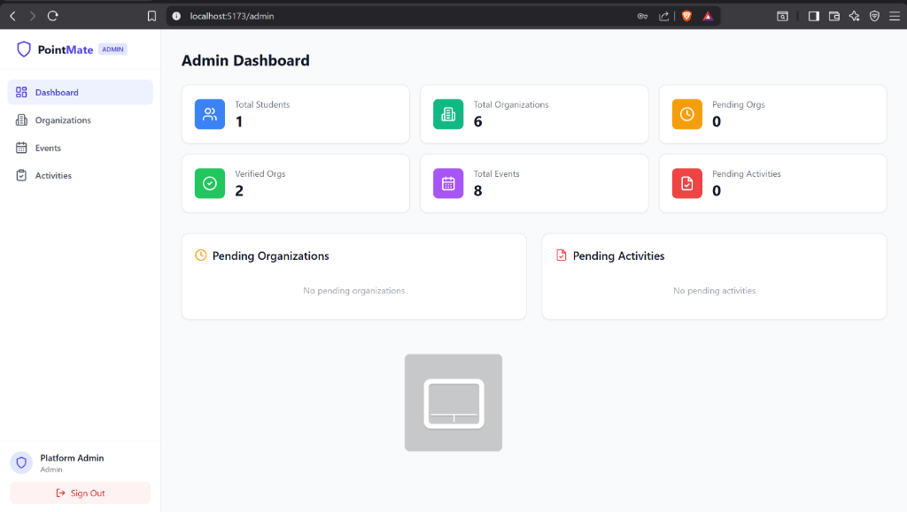
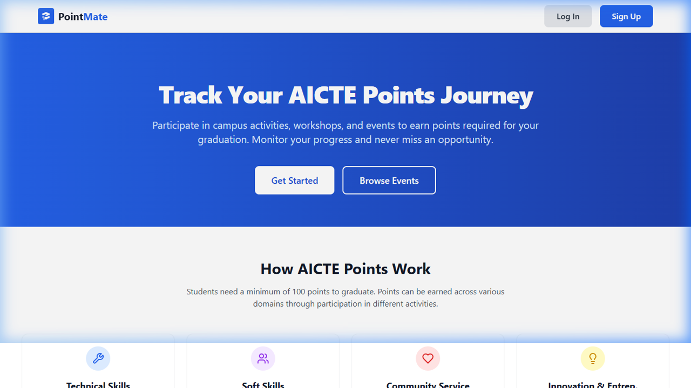
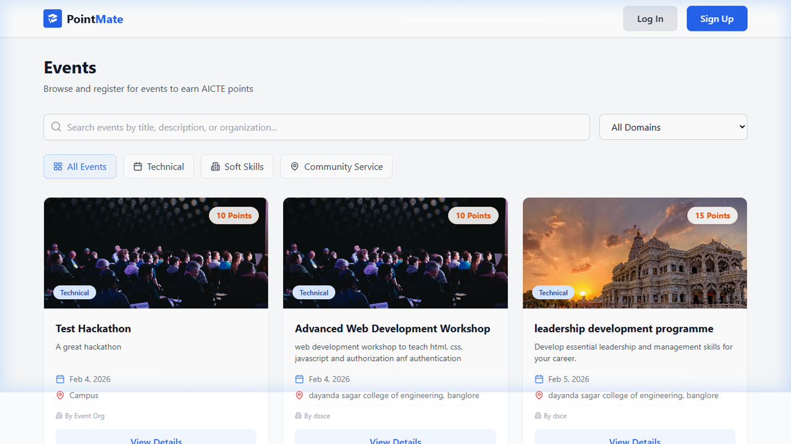
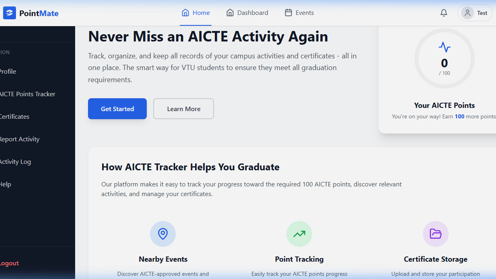
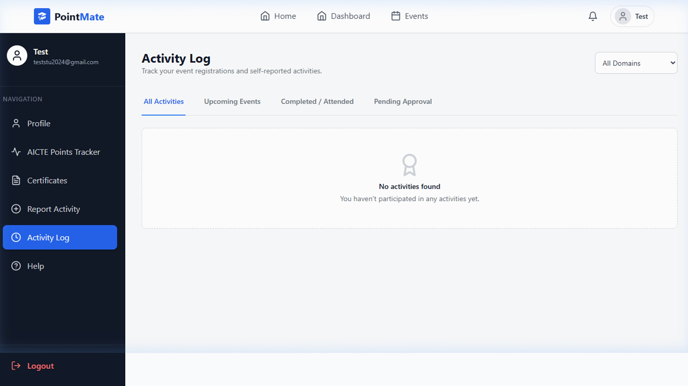
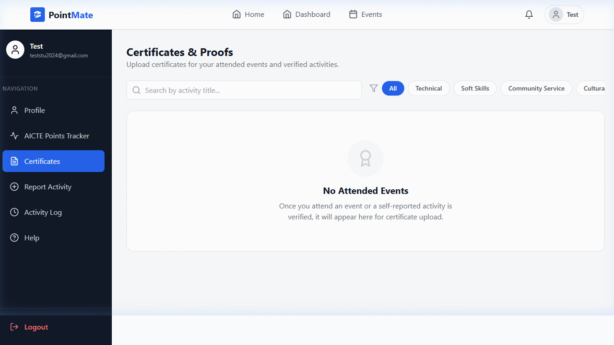
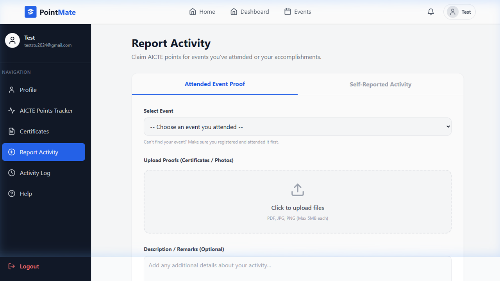
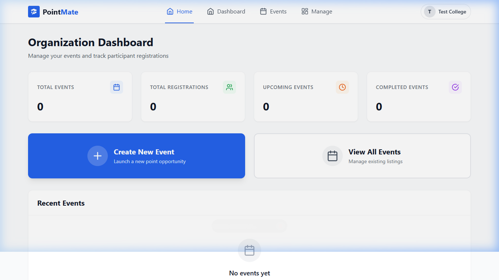
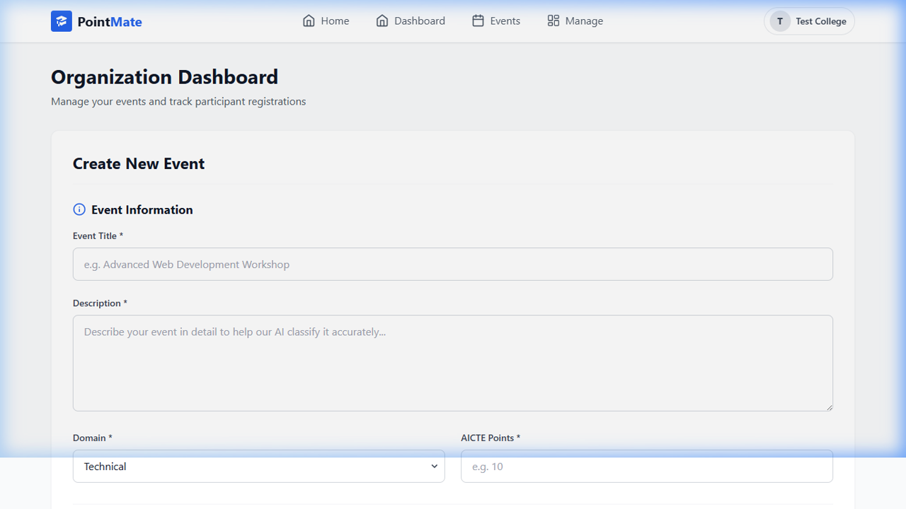
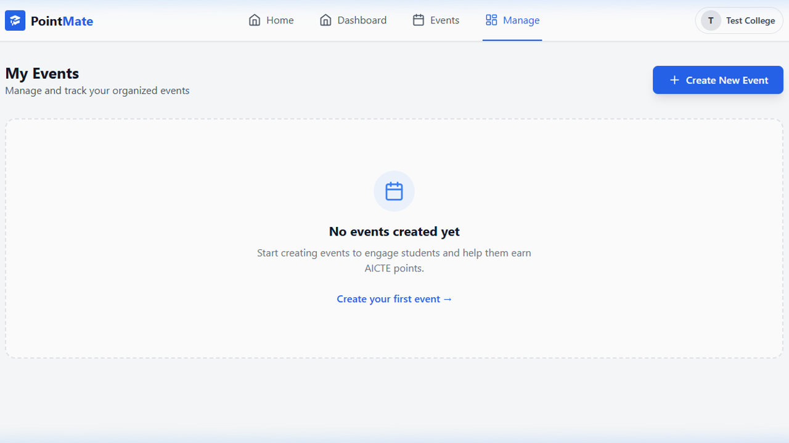

# 🎓 PointMate — AICTE Points Tracker

[](https://opensource.org/licenses/ISC)
[](https://nodejs.org/)
[](https://nextjs.org/)
[](https://www.mongodb.com/)

**PointMate** is a comprehensive platform designed to help Vishweswaraya Technological University (VTU) students track and manage their AICTE Activity Points. It streamlines the process of discovering events, logging activities, and managing participation certificates, ensuring students meet their graduation requirements effortlessly.


---

## 🔗 Live URLs

- **Frontend**: [https://rbac-project-sigma.vercel.app/](https://rbac-project-sigma.vercel.app/)
- **Backend**: [https://rbac-project-0334.onrender.com](https://rbac-project-0334.onrender.com)

## 📸 App Preview

<div align="center">
  <table>
    <tr>
      <td align="center"><b>🛡️ Admin Dashboard</b><br></td>
      <td align="center"><b>🏠 Homepage</b><br></td>
    </tr>
    <tr>
      <td align="center"><b>📅 Events Page</b><br></td>
      <td align="center"><b>🎓 Student Dashboard</b><br></td>
    </tr>
    <tr>
      <td align="center"><b>📋 Activity Log</b><br></td>
      <td align="center"><b>🏅 Certificates Page</b><br></td>
    </tr>
    <tr>
      <td align="center"><b>📝 Self Report Page</b><br></td>
      <td align="center"><b>🏢 Organization Dashboard</b><br></td>
    </tr>
    <tr>
      <td align="center"><b>➕ Organization – Event Creation</b><br></td>
      <td align="center"><b>⚙️ Organization – Event Management</b><br></td>
    </tr>
  </table>
</div>

---


## 🔑 Admin Test Credentials

- **Email**: admin2@pointmate.com
- **Password**: admin123

---


## 🚀 Key Features

### 👨‍🎓 For Students
- **Smart Dashboard**: Real-time visualization of AICTE points progress with a dynamic circular tracker.
- **Activity Timeline**: A premium, connected timeline showing recent engagements and their status (**Approved/Pending**).
- **Points Tracker**: Detailed breakdown of points earned across different AICTE categories.
- **Certificate Vault**: Secure storage and management of participation certificates and event photos.
- **Self-Reported Activities**: Ability to claim points for activities done outside the platform with **AI-assisted validation**.
- **Live Notifications**: Instant alerts for attendance marking, activity approvals, and upcoming events.

### 🏢 For Organizations (Colleges/NGOs)
- **Event Management**: Create and manage AICTE-approved campus events (restricted to verified organizations).
- **AI-Validation**: Uses Google's **Generative AI** to ensure events meet official AICTE guidelines.
- **Attendance System**: Quickly mark attendance, which automatically syncs points to student profiles.
- **Registration Review**: Streamlined interface to approve or reject student event registrations.

### 🔑 For Admins
- **Global Oversight**: Centralized dashboard to monitor students, organizations, and events.
- **Organization Verification**: Review and approve/reject new organization registrations to ensure platform integrity.
- **Activity Verification**: Verify self-reported student activities to award AICTE points.
- **Data Integrity**: Manage platform users and ensure cascading deletion of inactive organizations.


---

## 🛠️ Tech Stack

### 💻 Frontend
- **React.js & Next.js 16**: Core UI library and framework.
- **Tailwind CSS**: Modern utility-first styling.
- **Framer Motion**: Smooth animations for premium UX.
- **Lucide React**: Clean and consistent iconography.
- **React Hook Form**: Efficient form management and validation.
- **React Router DOM**: Client-side route management.
- **Axios**: Robust API communication.
- **Recharts**: Data visualization for points tracking.
- **React Hot Toast**: Beautiful, interactive notifications.
- **Date-fns**: Comprehensive date manipulation.

### 🏗️ Backend
- **Node.js & Express.js**: Server-side runtime and framework.
- **MongoDB & Mongoose**: Scalable NoSQL database and ORM.
- **JWT (JSON Web Token)**: Secure token-based authentication.
- **Bcryptjs**: Industrial-grade password hashing.
- **Cloudinary**: Cloud-based media storage for posters and certificates.
- **Google Generative AI**: Advanced AI engine for event validation.
- **Multer**: Handling multipart/form-data for file uploads.
- **QR Code**: Generating unique event registration codes.
- **Express Rate Limit**: Basic security against brute force attacks.


---

## ⚙️ Setup & Installation

### 📋 Prerequisites
- **Node.js** (v18+)
- **MongoDB** (Local or Atlas)
- **Cloudinary Account** (for media uploads)


### 1. Clone the repository
```bash
git clone <repository-url>
cd Pointmate_RBAC
```

### 2. Backend Setup
```bash
# Install backend dependencies
npm install

# Setup environment variables
cp .env.example .env
# Edit .env and add your MongoDB URL, JWT Secret, Cloudinary credentials, and Gemini API Key
```

### 3. Frontend Setup
```bash
cd frontend
# Install frontend dependencies
npm install

# Optional: if not already set at root, define frontend API URL for Next.js
# NEXT_PUBLIC_API_URL=http://localhost:5000/api
```

### 4. Running the Project
```bash
# Run Backend (from root)
npm run dev

# Run Frontend (from /frontend)
npm run dev
```

### 5. Frontend Production Commands (Next.js)
```bash
# From /frontend
npm run build
npm run start
```

---

## 📂 Project Structure

```text
Pointmate/
├── config/             # Database and Cloudinary configurations
├── controllers/        # Backend business logic
├── models/             # Mongoose schemas
├── routes/             # API endpoints
├── utils/              # Helper functions and AI validators
├── uploads/            # Local storage fallback for media
├── frontend/           # Next.js frontend application
│   ├── pages/          # Next.js entry pages and catch-all route
│   ├── src/
│   │   ├── components/ # Reusable UI components
│   │   ├── context/    # Auth and State management
│   │   ├── services/   # API service layer
│   │   └── pages/      # Main dashboard and landing pages
└── server.js           # Server entry point
```

---

## 📄 License
This project is licensed under the ISC License.

---

## 🌟 Acknowledgement
Developed to simplify the academic journey for VTU students.
